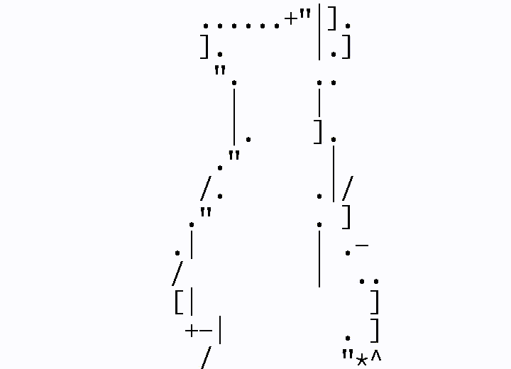

# AsCii Movie

Namely, this repo provides utils on converting normal videos to AsCii Movies.

Currently two output format is supported: image and txt

Also we provide utils on converting images to video and txt to [playable txt](https://github.com/nitram509/ascii-telnet-server)

## Examples

### Bad Apple



If you demand the output to be a video, we need

```bash
# we assume that you get the original video of bad apple by some means
#youtube-dl some-url
export VID=badapple.mp4
export N=$((`nproc`-1))
export TMPDIR=$(mktemp -d)
export RAW=$TMPDIR/raw
export ASC=$TMPDIR/asc
mkdir $RAW
mkdir $ASC
bash utils/ffmpeg.in.sh $VID 30 $RAW/%05d.png
parallel python img2ascii.py -j $N -n {} -i "$RAW/{:05d}.png" -o "$ASC/{:05d}.png" -s 40x12 -g ::: `seq "$N"`
bash utils/ffmpeg.out.sh $ASC/%05d.png 30 asc.$VID
bash utils/ffmpeg.merge.sh $VID asc.$VID final.$VID
rm -r $TMPDIR
```

Meanwhile, if you demand it to be a format compatible to [ascii-telnet-server](https://github.com/nitram509/ascii-telnet-server) (You may use my [fork](https://github.com/ZenithalHourlyRate/ascii-telnet-server/)) to play it. Please note the difference between `-g` and `-a`

```bash
# we assume that you get the original video of bad apple by some means
#youtube-dl some-url
export VID=badapple.mp4
export N=$((`nproc`-1))
export TMPDIR=$(mktemp -d)
export RAW=$TMPDIR/raw
export ASC=$TMPDIR/asc
mkdir $RAW
mkdir $ASC
bash utils/ffmpeg.in.sh $VID 30 $RAW/%05d.png
parallel python img2ascii.py -j $N -n {} -i "$RAW/{:05d}.png" -o "$ASC/{:05d}.png" -s 40x12 -a ::: `seq "$N"`
bash utils/ascii2telnet-server.py -i "$ASC/{:05d}.png" -o ba_telnet.txt
rm -r $TMPDIR
```

And use

```
cd /path/to/ascii-telnet-server
cp /path/to/acm/ba_telnet.txt ./
python ascii_telnet_server.py -f ba_telnet.txt --stdout -S 40x12 -s 80x25 -r 30
```

to play it. (Or you may just use `examples/ba_telnet.txt` in `acm` repo)

### 夜に駆ける


### もべもべ


